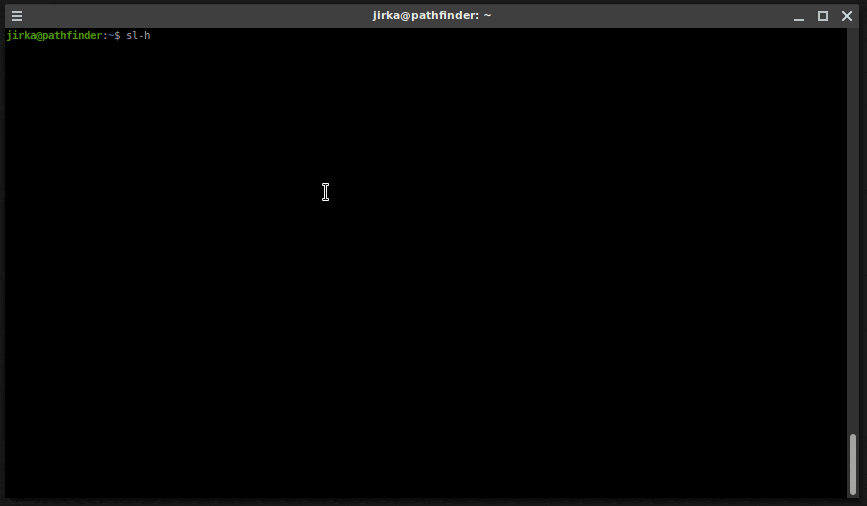

SL(1): Cure your bad habit of mistyping
=======================================

SL (Steam Locomotive) runs across your terminal when you type "sl" as
you meant to type "ls". It's just a joke command, and not useful at
all.

Copyright 1993,1998,2014 Toyoda Masashi (mtoyoda@acm.org)

Longer train - `sl-h`
-----------------------------

This version also contains `sl-h` version of the command taken from old Debian
version of the `sl`. It displays much longer (but interruptible) train on train
crossing.

